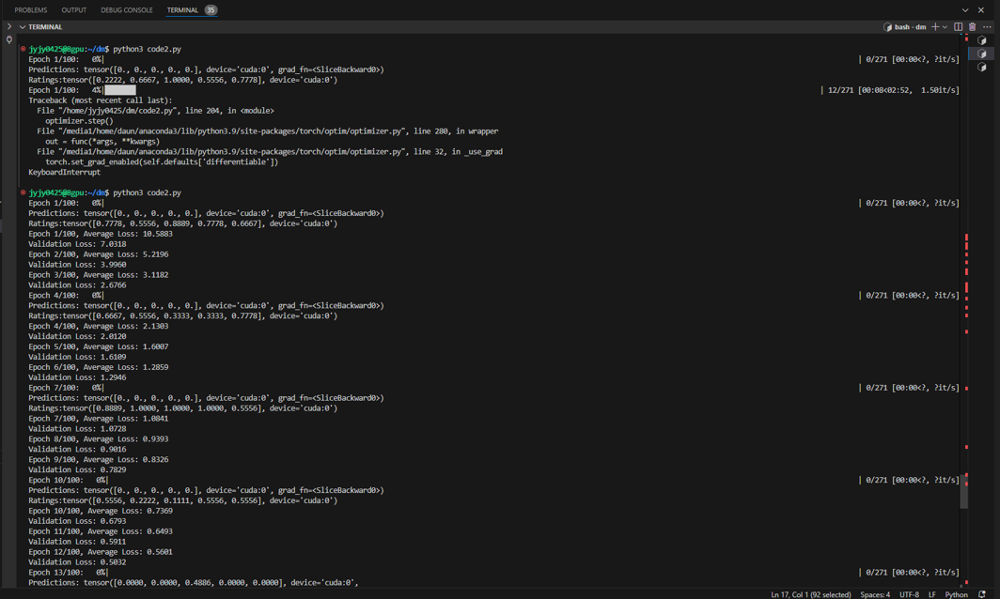
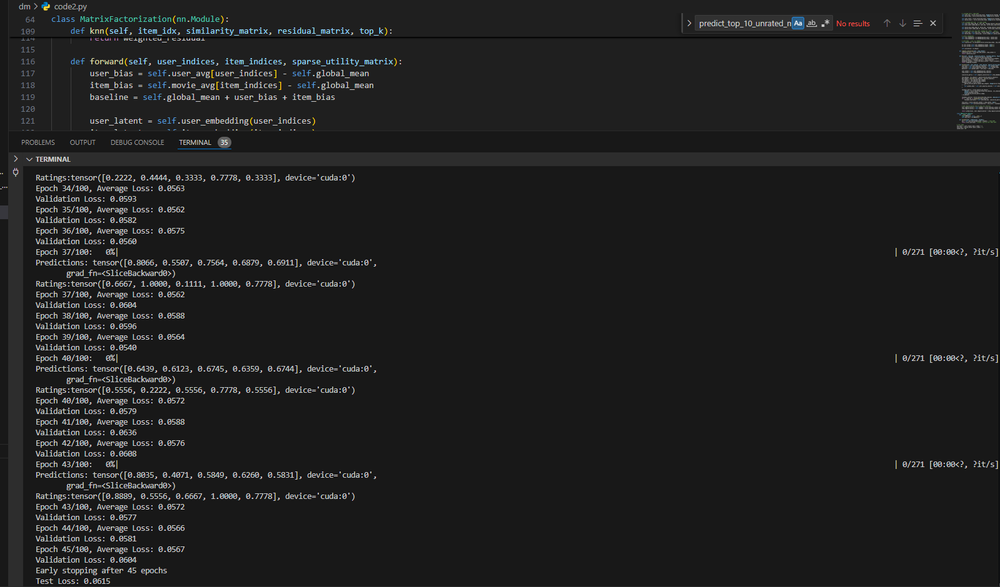
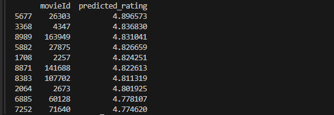
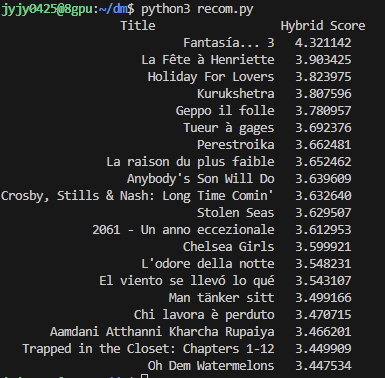

# MovieRecom

Movie Recommendation System: Contents Based &amp; Collaborative Filtering Hybrid 방식
Using Algorithm: Collaborative Filtering, SVD, KNN, Contents-Based Filtering, Hybrid Filtering

## Collaborative Filtering : recom_train.py

- recom_train.py: 모델 학습 코드
- recom_system.py: 학습된 모델을 통해 사용자가 rating하지 않은 영화를 추천하는 코드
- training 과정 - 시작 단계: loss 값 = 10.5883
  
- training 과정 - 학습 종료: loss 값 = 0.0615
  
- Recommendation 예시: rating 높게 예측한 상위 10개 영화 추천
  

## Contents Based Filtering : recom_system.py

- user-profile과 item-profile의 cosine similarity
- 사용자 프로필: 사용자가 평가한 영화와 그 평점을 기반으로 동적으로 생성.
- 특징: 영화의 장르, 키워드 및 기타 설명 데이터를 포함, 이외에도 영화 시청 시각도 피쳐로 활용함

## Hybrid Recommendation : recom_system.py

- 하이브리드 추천 시스템은 협업 필터링과 콘텐츠 기반 필터링의 장점을 결합하여 더 정교한 추천을 제공합니다.
- 협업 필터링: 사용자-아이템 상호작용 패턴을 기반으로 평점을 예측.
- 콘텐츠 기반 필터링: 메타데이터의 유사성을 통해 추천의 품질을 향상.
- 하이브리드 점수 계산: 협업 점수와 콘텐츠 점수를 결합한 가중 점수를 계산하여 보다 개인화된 추천 제공.
- 결과 화면
  
